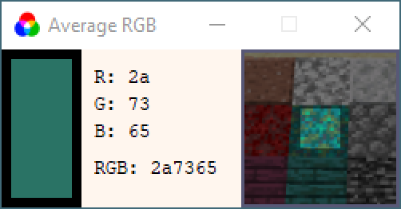
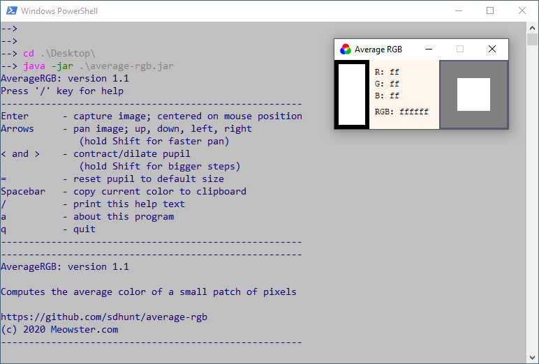
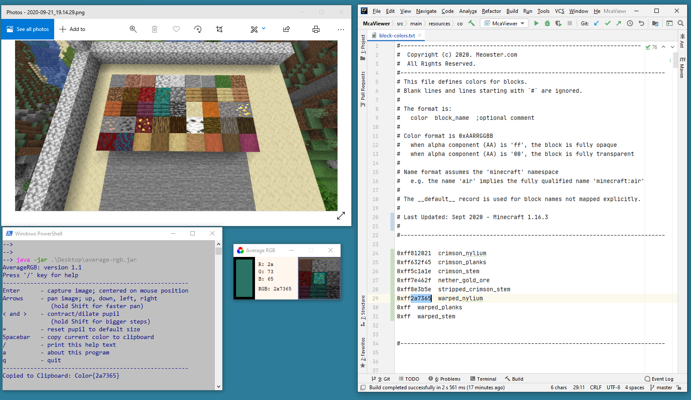

# average-rgb
A Color Picker that averages colors within an aperture.

I'm working on a program that generates a map from Minecraft world data.
Part of the configuration of this program is a file that associates
colors with "block" types. To facilitate choosing these colors, 
I wanted a simple app that averaged colors over a small pixel patch
of a game screenshot, with hex (`RRGGBB`) format.

I couldn't find an app for windows that did what I wanted,
so of course I had to write my own.

This little project is the result.



Do let me know if you use it, and find it useful.

_Cheers!_

## Packaged as a JAR

Invoke with the following in a command window, if you 
want to see the console output:
```
java -jar average-rgb.jar
```




## The App in Action


